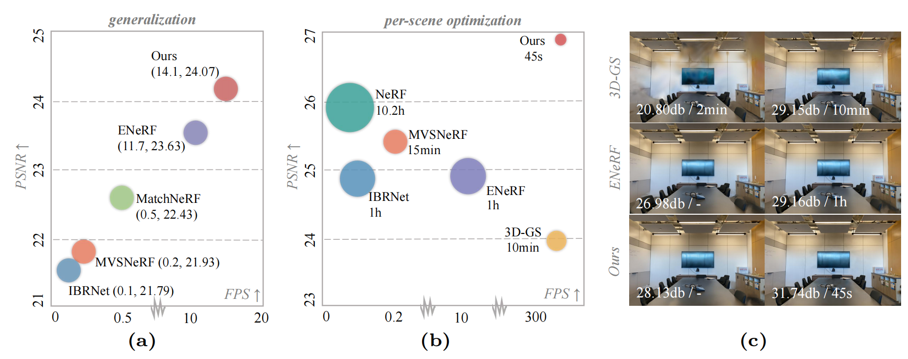

# MVSGaussian

Official implementation of **Fast Generalizable Gaussian Splatting Reconstruction from Multi-View Stereo**

[Tianqi Liu](https://tqtqliu.github.io/)<sup>1</sup>, [Guangcong Wang](https://wanggcong.github.io/)<sup>2,3</sup>, [Shoukang Hu](https://skhu101.github.io/)<sup>2</sup>, [Liao Shen](https://leoshen917.github.io/)<sup>1</sup>, [Xinyi Ye](https://scholar.google.com/citations?user=g_Y0w7MAAAAJ)<sup>1</sup>, [Yuhang Zang](http://yuhangzang.github.io/)<sup>4</sup>, [Zhiguo Cao](http://english.aia.hust.edu.cn/info/1085/1528.htm)<sup>1</sup>, [Wei Li](https://weivision.github.io/)<sup>2</sup>, [Ziwei Liu](https://liuziwei7.github.io/)<sup>2</sup>

<p><sup>1</sup>Huazhong University of Science and Technology &nbsp;&nbsp;<sup>2</sup>Nanyang Technological University &nbsp;&nbsp;

<sup>3</sup>Great Bay University &nbsp;&nbsp; <sup>4</sup>Shanghai AI Laboratory

## [Project page](https://mvsgaussian.github.io/) | [Paper](https://arxiv.org/abs/2405.12218) | [Youtube](https://youtu.be/4TxMQ9RnHMA) 


Coming soon!

>**TL;DR**: MVSGaussian is a Gaussian-based method designed for efficient reconstruction of unseen scenes from sparse views in a single forward pass. It offers high-quality initialization for fast training and real-time rendering.

## Introduction
We present MVSGaussian, a new generalizable 3D Gaussian representation approach derived from Multi-View Stereo (MVS) that can efficiently reconstruct unseen scenes.
Specifically, 1) we leverage MVS to encode geometry-aware Gaussian representations and decode them into Gaussian parameters. 2) To further enhance performance, we propose a hybrid Gaussian rendering that integrates an efficient volume rendering design for novel view synthesis. 3) To support fast fine-tuning for specific scenes, we introduce a multi-view geometric consistent aggregation strategy to effectively aggregate the point clouds generated by the generalizable model, serving as the initialization for per-scene optimization. Compared with previous generalizable NeRF-based methods, which typically require minutes of fine-tuning and seconds of rendering per image, MVSGaussian achieves real-time rendering with better synthesis quality for each scene. Compared with the vanilla 3D-GS, MVSGaussian achieves better view synthesis with less training computational cost. Extensive experiments on DTU, Real Forward-facing, NeRF Synthetic, and Tanks and Temples datasets validate that MVSGaussian attains state-of-the-art performance with convincing generalizability, real-time rendering speed, and fast per-scene optimization. 




## Citation
If you find our work useful for your research, please cite our paper.

```
@article{liu2024mvsgaussian,
    title={Fast Generalizable Gaussian Splatting Reconstruction from Multi-View Stereo},
    author={Liu, Tianqi and Wang, Guangcong and Hu, Shoukang and Shen, Liao and Ye, Xinyi and Zang, Yuhang and Cao, Zhiguo and Li, Wei and Liu, Ziwei},
    journal={arXiv preprint arXiv:2405.12218},
    year={2024}
}
```
